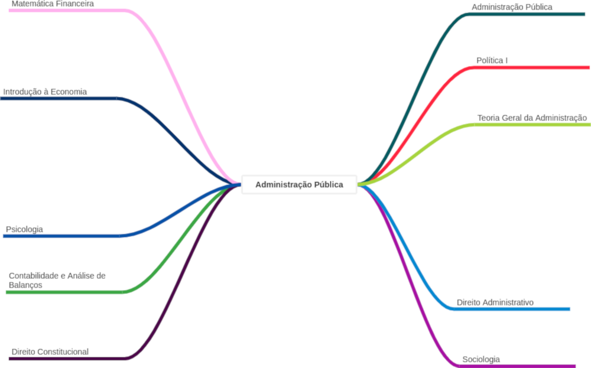

# Administração Pública

## Objetivo

* reconhecer e diagnosticar problemas, criando alternativas de solução, implantando-as e acompanhando-as;  
* ter liderança, flexibilidade e velocidade para atuar em situações de mudanças;  
* realizar o planejamento, a organização, a operação, o controle e a avaliação dos processos de gerenciamento das pessoas, dos recursos e dos sistemas de informação no âmbito da gestão pública municipal, estadual e federal; 
* e, ainda, executar serviços, elaborar e implementar projetos e criar e aperfeiçoar instrumentos para o desempenho qualificado da gestão pública.  

Além de atuar em órgãos de administração nos três níveis de governo, esse profissional pode, ainda, trabalhar em ONGs, OSCIPs e assessorar empresas especializadas em prestação de serviços para entidades públicas.

---

## Conselho
* [CFA](https://cfa.org.br/servicos-publicacoes/)
  * [IGM](https://igm.cfa.org.br/)   
* [CRA-RJ](https://cra-rj.adm.br/)
* [CRA-ES](https://www.craes.org.br/)
* [CRA-MG](https://www.cramg.org.br/)
* [CRA-SP](https://crasp.gov.br/)
* [CRA-BA](https://cra-ba.org.br/)
