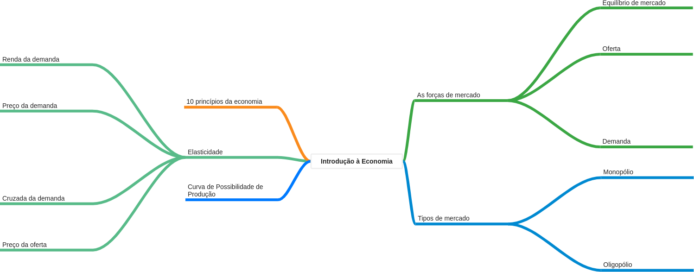

# Introdução à Economia

## OBJETIVO: 
Discutir com os alunos os conceitos e as relações fundamentais das Ciências Econômicas. Discutir com os alunos os problemas relativos à má distribuição de renda e à ausência de políticas de desenvolvimento.  

## EMENTA: 
Dez princípios da Economia. 
Oferta e Demanda: como funcionam os mercados. Elasticidade e suas aplicações. 
Tipos de Mercado. Moeda. Conceitos fundamentais da contabilidade nacional. 
Crescimento x desenvolvimento econômico. Distribuição de Renda. 

## CONTEÚDO PROGRAMÁTICO: 
01. Dez Princípios de Economia. 
    * MANKIW; Capítulo 1; Página 3
02. As forças de mercado - o lado da demanda.
    * VASCONCELLOS; Página 31
    * MANKIW; Capítulo 4; Página 63 e Capítulo 6; Página 107 
03. As forças de mercado - o lado da oferta. 
04. Equilíbrio de mercado. 
05. Atividade Avaliativa 1. 
06. Elasticidade da demanda.
    * VASCONCELLOS; Página 39
    * MANKIW; Capítulo 5; Página 87
07. Elasticidade da oferta.
    * VASCONCELLOS; Página 44
    * MANKIW; Capítulo 5; Página 96 
08. Tipos de mercado - Monopólio.
    * VASCONCELLOS; Capítulo 7; Página 66
    * MANKIW; Capítulo 15; Página 281 e Capítulo 16; Página 311
09. Tipos de mercado - Oligopólio. 
    * VASCONCELLOS; Capítulo 7; Página 66
    * MANKIW; Capítulo 17; Página 329
10. Tipos de mercado - Mercados competitivos. 
11. O mercado de trabalho e suas especificidades. 
12. Moeda e o sistema monetário. 
13. Crescimento econômico (real x nominal). 
14. Desenvolvimento econômico. 
15. Distribuição de renda. 
16. Atividade Avaliativa. 
17. Prova final. 

## CARGA HORÁRIA (h/a): 
34 SÍNCRONAS e 34 ASSÍNCRONAS 

## METODOLOGIA DE EXECUÇÃO: 
Trabalho virtual, Exercícios, Seminários e Leitura orientada. 

## FORMA DE AVALIAÇÃO: 
Provas, Trabalhos, Resenhas e Seminários.  

## Nº MÍNIMO DE AVALIAÇÕES: 
02. Com EXAME FINAL. 

## CRITÉRIO DE APROVAÇÃO: 
Média e Frequência  

## BIBLIOGRAFIA RECOMENDADA: 
* MANKIW, N. Gregory. Introdução à Economia. São Paulo. Thomson Pioneira, 6º Ed. 2013. 
* NOGAMI, Otto e PASSOS, Carlos Roberto. Princípios de Economia. São Paulo. Thomson Pioneira. 2005.
* ROSSETTI, J. Paschoal. Introdução à Economia.São Paulo. Editora Atlas, 2003. 
* VASCONCELLOS, M. A.S. e GARCIA, M. E. Fundamentos de Economia. São Paulo, 3º Ed .2008: Editora Saraiva 
* VICECONT, P. E. V. Introdução à Economia. 2ª edição revisada e ampliada. São Paulo, 1996: Frase Editora 
